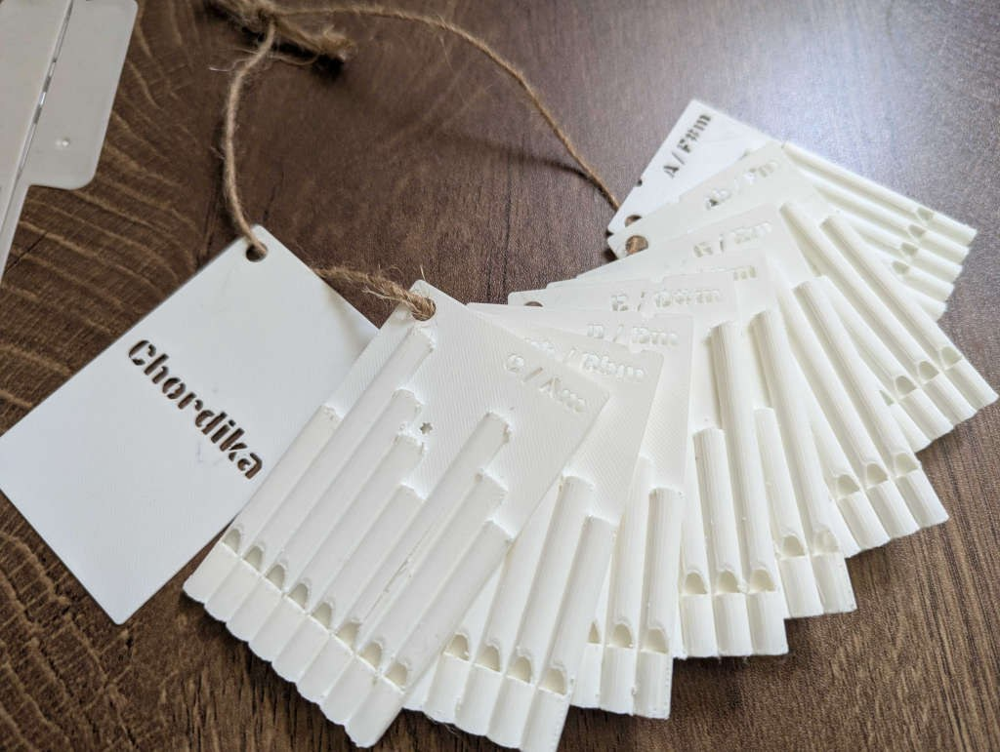

# Chordika（コーディカ）＆ Recorika（リコリカ）

**カードを持ち替えるだけで移調できる、3Dプリントの笛。**

For English, see [README.md](README.md).

クレジットカード大の板（85.6 × 54 × 4 mm）に、8本の笛を3Dプリントで融合しました。

- **Chordika** — 隣り合う3本を同時に吹くと、調律された三和音が鳴ります。12枚で全ての調
  をまかない、しかも**位置と和音の対応が12枚すべてで同じ**なので、カードを持ち替えると
  同じ手の動きがそのまま移調になります。
- **Recorika** — その対になる音階のカードです。左端が最低音、右へ行くほど高くなり、順に
  吹くと長音階が1オクターブ鳴ります。G・A♭・A の3調があります。

データを公開しているので、3Dプリンタがあれば誰でも同じものを刷れます。1枚はクレジットカードとまったく同じ大きさなので、財布やカードケースに入れて持ち歩けます。



**紹介サイト: https://unryu.org/chordika/**

## 並びのしくみ

どのカードでも、同じ位置が同じ和音の役割を持ちます。

| 吹く位置 | 1・2・3 | 2・3・4 | **3・4・5** | 4・5・6 | 5・6・7 | 6・7・8 |
|---|---|---|---|---|---|---|
| 和音 | V | iii | **I** | vi | IV | ii |
| C / Am なら | G | Em | **C** | Am | F | Dm |
| G / Em なら | D | Bm | **G** | Em | C | Am |

位置は、窓を上にして吹き込み口を手前に置いたときの、左から数えた番号です。カードには
主音の位置に＊が刻んであります。

したがって1枚のカードに、**長調とその平行短調の和音がひと通り**そろいます。欠けるのは
vii°（減三和音）だけです。

これは音を高さ順ではなく、**度数の連鎖（2・4・6・1・3・5・7・2）の順に並べている**ため
です。こうすると隣り合う3本が常にダイアトニックな三和音になります。カードの上では、この
連鎖は右端から左へ向かって並んでいます。

## このリポジトリの中身

```
index.html          紹介サイト（日本語・英語）
stl/                印刷データ — Chordika 12枚、Recorika 3枚、表紙1枚、箱2部品
stl/inverted/       おまけ。笛の並びを左右逆にした Chordika 12枚
3mf/                Bambu Lab A1 mini 用のスライス済みファイル（PLA）、同じ18点
3mf/inverted/       同じく逆並び版 12枚
video/              実際に吹いているところの短い動画
assets/             早見表（日英）、12調ぶんの対応表、写真と図版
```

**音を聴くには**、まず[デモ映像（YouTube）](https://www.youtube.com/watch?v=-cbyvgwa6VM)を
ご覧ください。[紹介サイト](https://unryu.org/chordika/)にも短い動画を置いてあります。
Chordika の和音、Recorika の音階、そして音階で吹いた曲の3本です。

**Bambu Lab A1 mini** をお使いなら、`3mf/` のファイルは下記の設定ですでにスライスして
あるので、そのまま印刷に送れます。フィラメントは Bambu PLA Basic を前提としており、
1枚あたり約 8.5 g・1時間15分ほどです。他のプリンタや別のフィラメントをお使いの場合は、
下記の設定で STL を自分でスライスしてください。

## 印刷のしかた

- **層の高さ 0.08 mm、外壁の線幅 0.5 mm。** 笛の壁が薄いので、粗くしないでください。
- **サポートは不要です。** そのまま平置きで刷れます。
- **1枚ずつ刷ってください。** 1プレートに2枚並べると1層あたりの時間が倍になり、カードの
  端が冷えて縮んで反ります。ブリムを付けても止まりません。
- **ブリムは5mm程度、隙間（brim gap）は0に。** 隙間を空けるとブリムが本体に融着せず、
  押さえの役目を果たしません。
- 白のPLAで良好な結果が出ています。透明のPETGも美しく、中の共鳴管が透けて見えます。

**吹く前に、必ず表面の尖った箇所を取り除いてください。** 刷り上がりには細かいバリや角が
残ります。口を当てて吹く道具なので、そのままだと危険です。私は何度か口を切りそうになりま
した。カードの縁と笛の吹き口まわりを指でなぞって確かめ、引っかかるところをやすりやカッター
の背でならしてください。

8本の吹き口はカードの片側の縁に一直線に並んでいます。その縁に唇を当て、横に滑らせながら
吹きます。息はリコーダーと同じくらいで、強く吹きすぎると1オクターブ上に飛びます。

## 表紙と箱

**表紙**（`chordika_cover.stl`）は笛の入っていない厚さ 0.5 mm の板で、Chordika の文字を切り
抜いてあります。大きさとストラップ穴の位置はカードと同じなので、12枚の上に重ねて同じ紐を
通せます。

**箱**は、上が開いた本体（`chordika_box_base.stl`）と、外側にかぶせる蓋
（`chordika_box_lid.stl`）の2部品です。カードを立てずに平積みで13枚ぶん収まり、蓋の天面には
表紙と同じ文字を切り抜いてあります。長辺のくぼみに指をかけてカードを取り出せます。かぶせた
状態でおよそ 94 × 62 × 57 mm です。

箱は笛ではないので、**層の高さ 0.2 mm の標準設定でサポートなし**で刷れます。カードほど細かく
刷る必要はありません。

## 設計について

管長と周波数の関係を、実際に刷って吹いた結果から `f = A/(L+e)` で近似しました。これを逆
に解けば欲しい音から管長が決まるので、Python（trimesh と manifold3d）で書いた生成器に調
を渡すだけでカードの3Dモデルが出てきます。板の厚みは 0.5 mm に固定してあり、これは笛の床
の厚みとぴったり同じ値です。ここを厚くすると共鳴管を侵食して、まったく鳴らなくなります。

## ライセンス

[CC BY-NC-ND 4.0](https://creativecommons.org/licenses/by-nc-nd/4.0/deed.ja) — 詳細は
[LICENSE](LICENSE) を参照してください。

**できること**: ダウンロードして自分で印刷し、演奏すること。出典を示したうえで、そのままの
形で人に見せたり配ったりすること。学校や勉強会で非営利に使うこと。

**できないこと**: 商用利用（印刷したものの販売、有料サービスでの提供など）。改変したデータ
の配布（寸法を変えた版、他の作品への組み込みなど）。

別の条件で使いたい場合はご相談ください。手元で改変を試すことまで禁じる意図はありませんが、
**改変したデータを配布すること**はご遠慮ください。

---

栗原一貴（津田塾大学）「AI笛作り」プロジェクトより。
